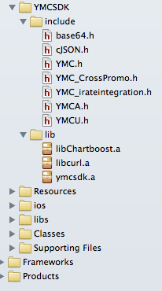

# YMC C++ SDK 

## Overview

**YMC SDK** offers mobile game developers the chance to sccess YMC User system and Analytics information.

For **Cocos2D-x** and other **C/C++** games, we deliver header files / libraries for both iOS & Android platforms, and they can be used immediately to utilize what's offered by the YMC User and Analytics systems. 

## Get Started
The C++ SDK is available from YMC Developer's site [https://developer.ymcgames.com](), and you should choose the binaries according to your target platforms (Android / iOS).

## What's inside the SDK
The SDK header files and libraries is organized as following folders:
 
	include/
		YMCU.h
		YMCA.h
		...
	lib/	
		ymcsdk.a
		...

and they should be put into your game project and accessed correctly.

## YMCU 
To use YMC User system, please use the APIs declared in the header file YMCU.h:

	#include "YMCU.h"
	
### Initialization  
Please call the following API to initialize things first:
  
	YMCResult YMCUserInit(YMCUserOptions* ymcUserOptions);
where the *YMCUserOptions* is declared as:

    typedef struct  {
        char game_id[MAX_GAME_ID_LENGTH];
        int use_test_server;  // 0 <- use live server, 1 <- use test server
    }YMCUserOptions;
	
Example:

	YMCUserOptions userOptions;
    strcpy(userOptions.game_id, YOUR_GAMEID);
    userOptions.use_test_server = 1;
    YMCUserInit( &userOptions );
    	
### Register a YMC account:
This API is for user account registration:
  
	YMCResult YMCUserRegister(eMail, password, username,NULL,NULL, NULL,
                          (YMCUOnSuccess)OnSuccess,
                          (YMCUOnError)OnError);
                          
Most YMCU APIs are implemented as asynchronous calls, and the following function points should be supplied as callback paramaters:

    void OnError(char* error_response, void* pdata);
    void OnSuccess(YMCUserSession *puserSession, void *pdata)

Example:

    void OnError(char* error_response, void* pdata)
	{
    	CCLOG("Error! ");
    	CCLOG("%s", error_response);
        //...
	}

	void OnSuccess(YMCUserSession *puserSession, void *pdata)
	{
    	CCLOG("Success! ");
    	CCLOG("access_token: %s", puserSession->access_token);
    	CCLOG("user_id: %d",puserSession->user_id);
    	CCLOG("expires: %d",puserSession->expires);
    
    	//...
    }

	YMCResult result;
    result = YMCUserRegister(eMail, password, username,NULL,NULL, NULL,
                          (YMCUOnSuccess)OnSuccess,
                          (YMCUOnError)OnError);
                         
### Login:
Same as Registration, only should be used for existing account:

	YMCResult result;
	result = YMCUserLogin(eMail, password, username, NULL,
                          (YMCUOnSuccess)OnSuccess,
                          (YMCUOnError)OnError);
    CCLOG("Login Result: %d",result);
    

### Logoff:

	YMCResult result;
    result = YMCUserLogout(&currentSession, NULL, NULL, NULL);
    CCLOG("Logoff Result: %d",result);
    
### Retrieve Profile of current user:
YMC User Account is described by the following Struct:

    typedef struct {
        char user_name[MAX_USER_NAME_LENGTH];
        char email[MAX_EMAIL_LENGTH];
        char first_name[MAX_NAME_LENGTH];
        char last_name[MAX_NAME_LENGTH];
        char gender[MAX_NAME_LENGTH];
        char gamesJSON[MAX_JSON_STRING];
    } YMCUser;
    
To retrieve the user details in current Session:    
    	
	YMCResult YMCUserGetInfo(YMCUserSession* userSession,
                            void* pdata,
                            YMCUOnSuccessUserInfo OnSuccess,
                            YMCUOnError OnError);
where the "OnSuccess" callback fuction pointer is declared as:

	typedef void (*YMCUOnSuccessUserInfo)(YMCUser* puser, void* pdata);
                           
### Ask for resending password to my Email:
This API is used to help the users when he forgot his password:
 
	YMCResult YMCUserPasswordForgot(const char* email,
                                    void* pdata,
                                    YMCUOnSuccessForgot OnSuccessForgot,
                                    YMCUOnError OnError);
     

## YMCA
To use YMC Analytics service, please use the APIs declared in the header file YMCA.h:

	#include "YMCA.h"

### Initialization
Please call yaInit to initialize with your Game's YMC ID:

	yaInit(YOUR_GAMEID);

### Track purchasement
yaCharge should be called to track any purchasement made by the game player.

    void yaCharge(const char *currency, double value);
    
Example:

     yaCharge("USD",6.99);
     yaCharge("RMB",35);

### yaEvent
Events describe things that happen in your game, usually as the result of user interaction; for example, when a player conquered a level, or purchased some equipment, you can send an event to record the incident.
	
### Track custom events
Sometimes you might want to track other specific things happened in your game, such as when the player passed one level, and YMCA allows developers construct customized yaEvent for such purpose: 

    yaEvent *yaEventCreate(const char *name);

    void yaAddNumber(yaEvent *event,const char*key,double value);

    void yaAddString(yaEvent *event,const char *key, const char *value); 

and track the custom event with:
    
    void yaTrack(yaEvent *event);		

Example:

	yaEvent *evt = yaEventCreate("Level_Up");
	yaAddString(evt, "Beat", "Playerx");
	yaAddNumber(evt, "Level", 10);
	yaTrack(evt);

