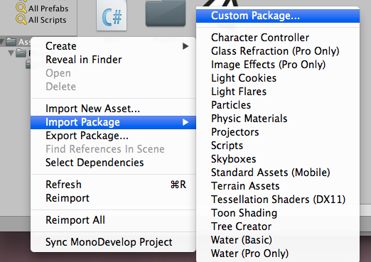
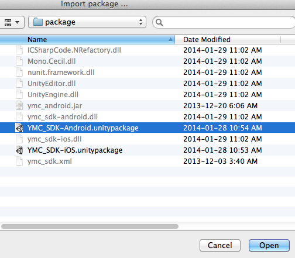

# YMC SDK for Unity3D games 
## (beta,haha!!!)

## Overview

**YMC SDK** offers mobile game developers the chance to sccess YMC User system and Analytics information.

For **Unity3D** games, we deliver packages for both iOS & Android platforms, and they can be used immediately to utilize things of the YMC User system and Analytics stuff. 

## Get Started
The YMC SDK for Unity is available from YMC Developer's site [https://developer.ymcgames.com](), and you could find the packages for both Android and iOS.

Please import the SDK package into your project:

## Initialization
Before using all the SDK APIs, the following static method should be called to initialize things:
	
	public static IEnumerator Init(string gameID, bool usingTestServer=false, bool debugInfo=false);
	
and normally it's called in an Unity MonoBehaviour as following:

	StartCoroutine(YMC.Init(YOUR_GAMEID));	

## YMCU
### Profile
A YMC User Account has the following properties: 
    
    public string UserName
			
	public string EMail	
		
	public string Password
			
	public string FirstName	
		
	public string LastName		
		
	public string Gender
	
Usage:

	YMCU.Profile p = new YMCU.Profile();
	p.EMail = "Nov27@123.com";
	p.Password = "4321";
	
### Session

YMCU Session is a singleton for Registration/Login/Logout to YMC User system:
	
	public static Session Instance;
	
Most methods are asynchronous, and the following callback delegates should be used:

	/// 
 delegate for successful YMCU operations. 

	public delegate void onSuccess();
	
	/// 
 delegate for successful User Profile retrieve.

	/// <param name="aProfile"> User Profile returned by the operation. </param>
	public delegate void onUserInfo(Profile aProfile);

	/// 
 delegate for failed YMCU operations.

	/// <param name="err"> The error message. </param>
	public delegate void onError(string err);
	
Initialization:

 	/// 
 Initialize the session.

    /// <param name="gid"> the YMC ID of current game. </param>
    /// <param name="isDebug"> Optional parameter to set to use the Testing server or not, is false by default. </param>	
	public void init(string gid, bool usingTestSetver=false);
	
Methods:

    /* retrieve the token of current session */
	public string getActiveToken();
	
	/// 
 check if already logged in the server.

    /// <param name="suc"> the delegate if already logged in. </param>
    /// <param name="err"> the delegate if not logged in yet. </param>
	public IEnumerator isLoggedin(onSuccess suc, onError err);
	
	/// 
 register with the server.

	/// <param name="p"> the YMC User profile/account. </param>
    /// <param name="suc"> the delegate if successfully registered. </param>
    /// <param name="err"> the delegate if failed registration. </param>
	public IEnumerator register(Profile p, onSuccess suc, onError err);
	
	/// 
 Login the server.

	/// <param name="p"> the YMC User profile/account. </param>
    /// <param name="suc"> the delegate if successfully logged in. </param>
    /// <param name="err"> the delegate if failed login. </param>
	public IEnumerator login(Profile p, onSuccess suc, onError err);
	
	/// 
 Login through Facebook.

	/// <param name="fbId"> the active Facebook Id. </param>
	/// <param name="fbId"> the active Facebook Token. </param>
    /// <param name="suc"> the delegate if successfully logged in. </param>
    /// <param name="err"> the delegate if failed login. </param>
	public IEnumerator loginFacebook(string fbId, string fbToken, onSuccess suc, onError err);
	
	/// 
 Logoff from YMC server.

	public IEnumerator logoff();
	
	/// 
 Call this when the user forgot his password.

	/// <param name="email"> the YMC User's email address. </param>
    /// <param name="suc"> the delegate if successfully handled the lost password. </param>
    /// <param name="err"> the delegate if failed. </param>
	public IEnumerator forgotPassword(string email, onSuccess suc, onError err);
	
	/// 
 Retrieve details of an User's profile.

    /// <param name="suc"> the delegate if successfully retrieved the profile. </param>
    /// <param name="err"> the delegate if failed. </param>
	public IEnumerator retrieveProfile(onUserInfo suc, onError err);
	
Example:

	///Callback delegate for success response:
	void succeed()
	{
		mResponse += "\nSuccess!!";
	}	
	
	///Callback delegate for error response:
	void error(string msg)
	{
		mResponse += "\n" + msg;
	}	

	/// Registration:
	IEnumerator yuRegister() {
		YMCU.Profile p = new YMCU.Profile();
		p.EMail = "Nov27@123.com";
		p.Password = "4321";
		
        YMCU.Session t = YMCU.Session.Instance;        
        return t.register(p, succeed, error);
    }
	
    /// Login:
	IEnumerator yuLogin() {
		YMCU.Profile p = new YMCU.Profile();
		p.EMail = "Nov27@123.com";
		p.Password = "4321";
		
        YMCU.Session t = YMCU.Session.Instance;        
        return t.login(p, succeed, error);
    }
	
	/// Logoff:
	IEnumerator yuLogoff() {		
        YMCU.Session t = YMCU.Session.Instance;        
        return t.logoff();
    }
	
	/// Check current session to see if it's already logged in:
	IEnumerator yuCheck() {
		YMCU.Session t = YMCU.Session.Instance;        
        return t.isLoggedin(succeed, error);
	}	

	/// callback delegate for successfully get user profile:
	void userInfo(YMCU.Profile p)
	{
		mResponse = "\n" + "eMail: " + p.EMail + "\n"
			      + "User Name: " + p.UserName + "\n"
				  + "First Name: " + p.FirstName + "\n"
				  + "Last Name: " + p.LastName + "\n"
				  + "Gender: " + p.Gender + "\n";
	}	
	
	/// Retrieve the profile of current user:	
	IEnumerator yuInfo() {
		YMCU.Session t = YMCU.Session.Instance;        
        return t.retrieveProfile(userInfo, error);
	}
	
	/// Login via Fackbook:
	IEnumerator yuFacebook() {  
		YMCU.Session t = YMCU.Session.Instance;        
        return t.loginFacebook("fbID", "fbToken", succeed, error);
	}
	
	/// Ask YMC server for password information:
	IEnumerator yuForgot() {  
		YMCU.Session t = YMCU.Session.Instance;        
        return t.forgotPassword("fengqi@ymcnetwork.com",succeed, error);
	}
	       

## YMCA

### YAEvent
Events that should be logged by YMC Analytics system are represented by YAEvent objects.

#### Object Property identifying the YAEvent:
    public string Name; 

#### Adding Event properties:
   
    /// 
 Put a integer property.

    /// <param name="key"> key of the property. </param>
    /// <param name="number"> integer value of the property. </param>
	public void putNumber(string key, int number);
	
	/// 
 Put a string property.

    /// <param name="key"> key of the property. </param>
    /// <param name="number"> string value of the property. </param>
	public void putString(string key, string value);
	
	
### Tracker
The Tracker is designed as a Singleton for tracking YAEvent, and should be bused as

	YMCA.Tracker t = YMCA.Tracker.Instance;
	
Initialization:

    /* set isDebug to be true if you want to see it from YMC debug view */
	public IEnumerator init(string aToken, bool isDebug = false);

Methods:

    /* to track a purchasement */
	public IEnumerator trackPayment(string currency, double amount);
	
	/* to track customized YAEvent */
	public override IEnumerator trackEvent(YAEvent e);

Example:

	/// Track a custom event "Level-Up":	 
	    IEnumerator yaCustom() {        
        YMCA.YAEvent e = new YMCA.YAEvent("Level-Up");
        e.putNumber("earned", 1000);
        e.putString("beat", "Somebody");
		
		YMCA.Tracker t = YMCA.Tracker.Instance;
        return t.trackEvent(e);
    }

	/// Track an In-App_Purchasement:
    IEnumerator yaPay() {
        YMCA.Tracker t = YMCA.Tracker.Instance;
        return t.trackPayment("CAD", 0.99);
    }
	

